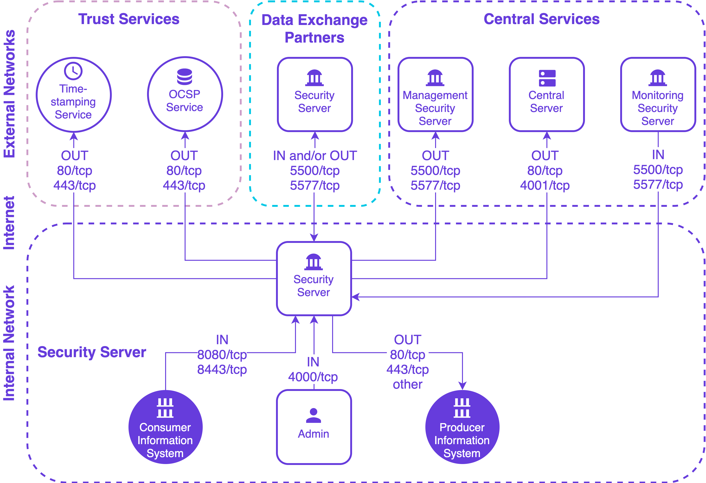
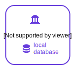
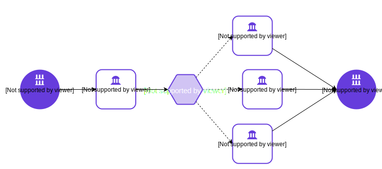

|  |
| -------------------------: |

# Security Server Installation Guide for Red Hat Enterprise Linux <!-- omit in toc -->

**X-ROAD 6**

Version: 1.12  
Doc. ID: IG-SS-RHEL

---


## Version history <!-- omit in toc -->

 Date       | Version | Description                                                     | Author
 ---------- | ------- | --------------------------------------------------------------- | --------------------
 25.10.2018 | 1.0     | Initial version                                                 | Petteri Kivimäki
 16.11.2018 | 1.1     | Update link to Ubuntu installation guide                        | Jarkko Hyöty
 28.01.2018 | 1.2     | Update port 2080 documentation                                  | Petteri Kivimäki
 11.09.2019 | 1.3     | Remove Ubuntu 14.04 from supported platforms                    | Jarkko Hyöty
 12.09.2019 | 1.4     | Add instruction for remote database usage                       | Ilkka Seppälä
 10.10.2019 | 1.5     | Add instructions for binding xroad-proxy to ports 80,443        | Jarkko Hyöty
 30.04.2020 | 1.6     | Add instructions how to use remote database located in Microsoft Azure        | Ilkka Seppälä
 12.06.2020 | 1.7     | Update reference data regarding JMX listening ports | Petteri Kivimäki
 24.06.2020 | 1.8     | Add repository sign key details in section [2.2 Reference data](#22-reference-data) | Petteri Kivimäki
 24.06.2020 | 1.9     | Remove environmental and operational monitoring daemon JMX listening ports from section [2.2 Reference data](#22-reference-data) | Petteri Kivimäki
 09.08.2020 | 1.10    | Update ports information in section [2.2 Reference data](#22-reference-data), add section [2.2.1 Network Diagram](#221-network-diagram) | Petteri Kivimäki
 17.08.2020 | 1.11    | Update for RHEL 8. Document id and name changed.                | Jarkko Hyöty
 16.09.2020 | 1.12    | Describe deployment options and database customization options. | Ilkka Seppälä

## License

This document is licensed under the Creative Commons Attribution-ShareAlike 3.0 Unported License. To view a copy of this license, visit http://creativecommons.org/licenses/by-sa/3.0/


## Table of Contents <!-- omit in toc -->

<!-- toc -->
<!-- vim-markdown-toc GFM -->

- [License](#license)
- [1 Introduction](#1-introduction)
  - [1.1 Target Audience](#11-target-audience)
  - [1.2 Terms and abbreviations](#12-terms-and-abbreviations)
  - [1.3 References](#13-references)
- [2 Installation](#2-installation)
  - [2.1 Prerequisites to Installation](#21-prerequisites-to-installation)
  - [2.2 Reference Data](#22-reference-data)
    - [2.2.1 Network Diagram](#221-network-diagram)
  - [2.3 Requirements for the Security Server](#23-requirements-for-the-security-server)
  - [2.4 Preparing OS](#24-preparing-os)
  - [2.5 Prepare for Installation](#25-prepare-for-installation)
  - [2.5.1 Customize the Database Properties](#251-customize-the-database-properties)
  - [2.6 Remote Database Installation](#26-remote-database-installation)
  - [2.7 Setup Package Repository](#27-setup-package-repository)
  - [2.8 Package Installation](#28-package-installation)
  - [2.8.1 Configure Proxy Ports](#281-configure-proxy-ports)
  - [2.8.2 Start Security Server](#282-start-security-server)
  - [2.9 Post-Installation Checks](#29-post-installation-checks)
  - [2.10 Installing the Support for Hardware Tokens](#210-installing-the-support-for-hardware-tokens)
  - [2.11 Installing the Support for Environmental Monitoring](#211-installing-the-support-for-environmental-monitoring)
  - [2.12 Remote Database Post-Installation Tasks](#212-remote-database-post-installation-tasks)
- [3 Security Server Initial Configuration](#3-security-server-initial-configuration)
  - [3.1 Prerequisites](#31-prerequisites)
  - [3.2 Reference Data](#32-reference-data)
  - [3.3 Configuration](#33-configuration)
- [Annex A Security Server Default Database Properties](#annex-a-security-server-default-database-properties)
- [Annex B Deployment Options](#annex-b-deployment-options)
  - [B.1 General](#b1-general)
  - [B.2 Local Database](#b2-local-database)
  - [B.3 Remote Database](#b3-remote-database)
  - [B.4 High Availability Setup](#b4-high-availability-setup)
  - [B.5 Load Balancing Setup](#b5-load-balancing-setup)
  - [B.6 Summary](#b6-summary)

<!-- vim-markdown-toc -->
<!-- tocstop -->


## 1 Introduction


### 1.1 Target Audience

The intended audience of this Installation Guide are X-Road Security server system administrators responsible for installing and using X-Road software. The daily operation and maintenance of the security server is covered by its User Guide \[[UG-SS](#Ref_UG-SS)\].

The document is intended for readers with a moderate knowledge of Linux server management, computer networks, and the X-Road working principles.


### 1.2 Terms and abbreviations

See X-Road terms and abbreviations documentation \[[TA-TERMS](#Ref_TERMS)\].

### 1.3 References

1.  <a id="Ref_UG-SS" class="anchor"></a>\[UG-SS\] X-Road 6. Security Server User Guide. Document ID: [UG-SS](ug-ss_x-road_6_security_server_user_guide.md)

2.  <a id="Ref_TERMS" class="anchor"></a>\[TA-TERMS\] X-Road Terms and Abbreviations. Document ID: [TA-TERMS](../terms_x-road_docs.md).


## 2 Installation


### 2.1 Prerequisites to Installation

There are multiple alternatives how the security server can be deployed. The options are described in [Annex B Deployment Options](#annex-b-deployment-options).

The security server runs on the following platforms:

* Red Hat Enterprise Linux (RHEL) versions 7 and 8 on a x86-64 platform.
* Ubuntu Server 18.04 on a x86-64 platform. See [IG-SS](ig-ss_x-road_v6_security_server_installation_guide.md) for more information.

The software can be installed both on physical and virtualized hardware (of the latter, Xen and Oracle VirtualBox have been tested).


### 2.2 Reference Data

*Note*: The information in empty cells should be determined before the server’s installation, by the person performing the installation.

**Caution**: Data necessary for the functioning of the operating system is not included.


| Ref     |                           | Explanation |
| ------- | --------------------------| ---------------------------------------------------------- |
| 1.0     | RHEL (7.3 or newer; 8.0 or newer), x86-64 CPU, 4 GB RAM, 10 GB free disk space | Minimum requirements
| 1.1     | https://artifactory.niis.org/xroad-release-rpm  | X-Road package repository
| 1.2     | https://artifactory.niis.org/api/gpg/key/public | The repository key.<br /><br />Hash: `935CC5E7FA5397B171749F80D6E3973B`<br  />Fingerprint: `A01B FE41 B9D8 EAF4 872F  A3F1 FB0D 532C 10F6 EC5B`<br  />3rd party key server: [SKS key servers](http://pool.sks-keyservers.net/pks/lookup?op=vindex&hash=on&fingerprint=on&search=0xFB0D532C10F6EC5B)
| 1.3     |                                         | Account name in the user interface
| 1.4     | **Inbound ports from external network** | Ports for inbound connections from the external network to the security server
|         | TCP 5500                                | Message exchange between security servers
|         | TCP 5577                                | Querying of OCSP responses between security servers
| 1.5     | **Outbound ports to external network**  | Ports for outbound connections from the security server to the external network
|         | TCP 5500                                | Message exchange between security servers
|         | TCP 5577                                | Querying of OCSP responses between security servers
|         | TCP 4001                                | Communication with the central server
|         | TCP 80                                  | Downloading global configuration from the central server
|         | TCP 80,443                              | Most common OCSP and time-stamping services
| 1.6     | **Inbound ports from internal network** | Ports for inbound connections from the internal network to the security server
|         | TCP 4000                                | User interface and management REST API (local network). **Must not be accessible from the internet!**
|         | TCP 8080 (or TCP 80), 8443 (or TCP 443) | Information system access points (in the local network). **Must not be accessible from the external network without strong authentication. If open to the external network, IP filtering is strongly recommended.**
| 1.7     | **Outbound ports to internal network**  | Ports for inbound connections from the internal network to the security server
|         | TCP 80, 443, *other*                    | Producer information system endpoints
|         | TCP 2080                                | Message exchange between security server and operational data monitoring daemon (by default on localhost)
| 1.8     |                                         | Security server internal IP address(es) and hostname(s)
| 1.9     |                                         | Security server public IP address, NAT address

It is strongly recommended to protect the security server from unwanted access using a firewall (hardware or software based). The firewall can be applied to both incoming and outgoing connections depending on the security requirements of the environment where the security server is deployed. It is recommended to allow incoming traffic to specific ports only from explicitly defined sources using IP filtering. **Special attention should be paid with the firewall configuration since incorrect configuration may leave the security server vulnerable to exploits and attacks.**


#### 2.2.1 Network Diagram

The network diagram below provides an example of a basic Security Server setup. Allowing incoming connections from the Monitoring Security Server on ports 5500/tcp and 5577/tcp is necessary for the X-Road Operator to be able to monitor the ecosystem and provide statistics and support for Members.



The table below lists the required connections between different components.

| Connection Type | Source | Target | Target Ports | Protocol | Note |
|-----------|------------|-----------|-----------|-----------|-----------|
| Out | Security Server | Central Server | 80, 4001 | tcp | |
| Out | Security Server | Management Security Server | 5500, 5577 | tcp | |
| Out | Security Server | OCSP Service | 80 / 443 | tcp | |
| Out | Security Server | Timestamping Service | 80 / 443 | tcp | |
| Out | Security Server | Data Exchange Partner Security Server (Service Producer) | 5500, 5577 | tcp | |
| Out | Security Server | Producer Information System | 80, 443, other | tcp | Target in the internal network |
| In  | Monitoring Security Server | Security Server | 5500, 5577 | tcp | |
| In  | Data Exchange Partner Security Server (Service Consumer) | Security Server | 5500, 5577 | tcp | |
| In | Consumer Information System | Security Server | 8080, 8443 | tcp | Source in the internal network |
| In | Admin | Security Server | 4000 | tcp | Source in the internal network |


### 2.3 Requirements for the Security Server

Minimum recommended hardware parameters:

* the server’s hardware (motherboard, CPU, network interface cards, storage system) must be supported by RHEL in general;
* a x86-64 dual-core Intel, AMD or compatible CPU; AES instruction set support is highly recommended;
* 2 CPU;
* 4 GB RAM;
* 10 GB free disk space (OS partition), 20-40 GB free disk space (`/var` partition);
* a 100 Mbps network interface card.

Requirements to software and settings:

* an installed and configured RHEL (v7.3 or newer) x86-64 operating system;
* if the security server is separated from other networks by a firewall and/or NAT, the necessary connections to and from the security server are allowed (**reference data: 1.4; 1.5; 1.6; 1.7**). The enabling of auxiliary services which are necessary for the functioning and management of the operating system (such as DNS, NTP, and SSH) stay outside the scope of this guide;
* if the security server has a private IP address, a corresponding NAT record must be created in the firewall (**reference data: 1.9**).


### 2.4 Preparing OS

* Set the operating system locale. Add following line to the `/etc/environment` file.

        LC_ALL=en_US.UTF-8

* Install `yum-utils`, a collection of utilities that integrate with yum to extend its native features.

        sudo yum install yum-utils


### 2.5 Prepare for Installation

The database properties created by the default installation can be found at [Annex A Security Server Default Database Properties](#annex-a-security-server-default-database-properties). If necessary, it's possible to customize the database names, users, passwords etc. by following the steps in [2.5.1 Customize the Database Properties](#251-customize-the-database-properties).


### 2.5.1 Customize the Database Properties

**This is an optional step.** Security server uses `/etc/xroad/db.properties` file to store the database properties. It's possible to customize the installation by precreating this file before running the installer. First create the `xroad` user, directory and the file as follows:

  ```
  sudo useradd --system --home /var/lib/xroad --no-create-home --shell /bin/bash --user-group --comment "X-Road system user" xroad
  sudo mkdir /etc/xroad
  sudo chown xroad:xroad /etc/xroad
  sudo chmod 751 /etc/xroad
  sudo touch /etc/xroad/db.properties
  sudo chown xroad:xroad /etc/xroad/db.properties
  sudo chmod 640 /etc/xroad/db.properties
  ```

Then edit `/etc/xroad/db.properties` contents. See the template below. Replace the parameter values with your own. The default values can be found in [Annex A Security Server Default Database Properties](#annex-a-security-server-default-database-properties). Note that you only need to define the properties that need to be customized, elsewhere the defaults apply.

  ```
  serverconf.hibernate.jdbc.use_streams_for_binary = true
  serverconf.hibernate.dialect = ee.ria.xroad.common.db.CustomPostgreSQLDialect
  serverconf.hibernate.connection.driver_class = org.postgresql.Driver
  serverconf.hibernate.connection.url = jdbc:postgresql://<host:port>/serverconf
  serverconf.hibernate.connection.username = <serverconf username>
  serverconf.hibernate.connection.password = <serverconf password>
  messagelog.hibernate.jdbc.use_streams_for_binary = true
  messagelog.hibernate.dialect = ee.ria.xroad.common.db.CustomPostgreSQLDialect
  messagelog.hibernate.connection.driver_class = org.postgresql.Driver
  messagelog.hibernate.jdbc.batch_size = 50
  messagelog.hibernate.connection.url = jdbc:postgresql://<host:port>/messagelog
  messagelog.hibernate.connection.username = <messagelog username>
  messagelog.hibernate.connection.password = <messagelog password>
  serverconf.hibernate.hikari.dataSource.currentSchema = serverconf,public
  ```


### 2.6 Remote Database Installation

**This is an optional step.** If you want to use remote database server instead of the default locally installed one, you need to pre-create a configuration file containing at least the database administrator master password. Create the file by performing the following steps:

  ```
  sudo touch /etc/xroad.properties
  sudo chown root:root /etc/xroad.properties
  sudo chmod 600 /etc/xroad.properties
  ```

  Edit `/etc/xroad.properties` contents. See the example below. Replace parameter values with your own.

  ```
  postgres.connection.password = <database superuser password>
  postgres.connection.user = <database superuser name, postgres by default>
  ```

* If Microsoft Azure database for PostgreSQL is used, the connection user needs to be in format `username@servername`.
* One should verify that the version of the local PostgreSQL client matches the version of the remote PostgreSQL server.


### 2.7 Setup Package Repository

Add X-Road package repository (**reference data: 1.1**) and Extra Packages for Enterprise Linux (EPEL) repository:

  ```
  RHEL_MAJOR_VERSION=$(source /etc/os-release;echo ${VERSION_ID%.*})
  sudo yum install https://dl.fedoraproject.org/pub/epel/epel-release-latest-${RHEL_MAJOR_VERSION}.noarch.rpm
  sudo yum-config-manager --add-repo https://artifactory.niis.org/xroad-release-rpm/rhel/${RHEL_MAJOR_VERSION}/current
  ```

The following packages are fetched from EPEL: _crudini_, and _rlwrap_.

Add the X-Road repository’s signing key to the list of trusted keys (**reference data: 1.2**):

  ```
  sudo rpm --import https://artifactory.niis.org/api/gpg/key/public
  ```


### 2.8 Package Installation

Issue the following command to install the security server packages (use package `xroad-securityserver-ee` to include configuration specific to Estonia; use package `xroad-securityserver-fi` to include configuration specific to Finland):

  ```
  sudo yum install xroad-securityserver
  ```

Add system user (**reference data: 1.3**) whom all roles in the user interface are granted to. Add a new user with the command

  ```
  sudo xroad-add-admin-user <username>
  ```

User roles are discussed in detail in X-Road Security Server User Guide \[[UG-SS](#Ref_UG-SS)\].


### 2.8.1 Configure Proxy Ports

**This is an optional step.** Change `xroad-proxy` to use ports 80 and 443.

By default, `xroad-proxy` listens for consumer information system connections on ports 8080 (HTTP) and 8443 (HTTPS). To use standard HTTP(S) ports 80 and 443, verify that the ports are free, and make the following modifications:

Edit `/etc/xroad/conf.d/local.ini` and add the following properties in the `[proxy]` section:

  ```
  [proxy]
  client-http-port=80
  client-https-port=443
  ```


### 2.8.2 Start Security Server

Once the installation is completed, start the security server

  ```
  sudo systemctl start xroad-proxy
  ```


### 2.9 Post-Installation Checks

The installation is successful if system services are started and the user interface is responding.

* Ensure from the command line that X-Road services are in the `running` state (example output follows):
  
  ```
  sudo systemctl list-units "xroad-*"

  UNIT                       LOAD   ACTIVE SUB     DESCRIPTION
  xroad-confclient.service   loaded active running X-Road confclient
  xroad-monitor.service      loaded active running X-Road Monitor
  xroad-opmonitor.service    loaded active running X-Road opmonitor daemon
  xroad-proxy-ui-api.service loaded active running X-Road Proxy UI REST API
  xroad-proxy.service        loaded active running X-Road Proxy
  xroad-signer.service       loaded active running X-Road signer
  ```

* Ensure that the security server user interface at https://SECURITYSERVER:4000/ (**reference data: 1.8; 1.6**) can be opened in a Web browser. To log in, use the account name chosen during the installation (**reference data: 1.3**). While the user interface is still starting up, the Web browser may display the “502 Bad Gateway” error.


### 2.10 Installing the Support for Hardware Tokens

Hardware security tokens (smartcard, USB token, Hardware Security Module) have not been tested on RHEL. Therefore, support is not provided.


### 2.11 Installing the Support for Environmental Monitoring

The support for environmental monitoring functionality on a security server is provided by package xroad-monitor that is installed by default. The package installs and starts the `xroad-monitor` process that will gather and make available the monitoring information.


### 2.12 Remote Database Post-Installation Tasks

Local PostgreSQL is always installed with Security Server. When remote database host is used, the local PostgreSQL can be stopped and disabled after the installation.

To stop the local PostgreSQL server

`systemctl stop postgresql`

To disable the local PostgreSQL server so that it does not start automatically when the server is rebooted.

`systemctl mask postgresql`


## 3 Security Server Initial Configuration

During the security server initial configuration, the server’s X-Road membership information and the software token’s PIN are set.


### 3.1 Prerequisites

Configuring the security server assumes that the security server owner is a member of the X-Road.


### 3.2 Reference Data

ATTENTION: Reference items 2.1 - 2.3 in the reference data are provided to the security server owner by the X-Road central’s administrator.

The security server code and the software token’s PIN will be determined during the installation at the latest, by the person performing the installation.

 Ref  |                                                   | Explanation
 ---- | ------------------------------------------------- | --------------------------------------------------
 2.1  | &lt;global configuration anchor file&gt; or &lt;URL&gt; | Global configuration anchor file
 2.2  | E.g.<br>GOV - government<br> COM - commercial     | Member class of the security server's owner
 2.3  | &lt;security server owner register code&gt;       | Member code of the security server's owner
 2.4  | &lt;choose security server identificator name&gt; | Security server's code
 2.5  | &lt;choose PIN for software token&gt;             | Software token’s PIN


### 3.3 Configuration

To perform the initial configuration, open the address

    https://SECURITYSERVER:4000/

in a Web browser (**reference data: 1.8; 1.6**). To log in, use the account name chosen during the installation (**reference data: 1.3).**

Upon first log-in, the system asks for the following information.

* The global configuration anchor file (**reference data: 2.1**).

    **Please verify anchor hash value with the published value.**

If the configuration is successfully downloaded, the system asks for the following information.

* The security server owner’s member class (**reference data: 2.2**).
* The security server owner’s member code (**reference data: 2.3**).

  If the member class and member code are correctly entered, the system displays the security server owner’s name as registered in the X-Road center.

* Security server code (**reference data: 2.4**), which is chosen by the security server administrator and which has to be unique across all the security servers belonging to the same X-Road member.
* Software token’s PIN (**reference data: 2.5**). The PIN will be used to protect the keys stored in the software token. The PIN must be stored in a secure place, because it will be no longer possible to use or recover the private keys in the token once the PIN has been lost.


## Annex A Security Server Default Database Properties

`/etc/xroad/db.properties`

```
serverconf.hibernate.jdbc.use_streams_for_binary = true
serverconf.hibernate.dialect = ee.ria.xroad.common.db.CustomPostgreSQLDialect
serverconf.hibernate.connection.driver_class = org.postgresql.Driver
serverconf.hibernate.connection.url = jdbc:postgresql://127.0.0.1:5432/serverconf
serverconf.hibernate.connection.username = serverconf
serverconf.hibernate.connection.password = <randomly generated password stored is stored here>
messagelog.hibernate.jdbc.use_streams_for_binary = true
messagelog.hibernate.dialect = ee.ria.xroad.common.db.CustomPostgreSQLDialect
messagelog.hibernate.connection.driver_class = org.postgresql.Driver
messagelog.hibernate.jdbc.batch_size = 50
messagelog.hibernate.connection.url = jdbc:postgresql://127.0.0.1:5432/messagelog
messagelog.hibernate.connection.username = messagelog
messagelog.hibernate.connection.password = <randomly generated password stored is stored here>
serverconf.hibernate.hikari.dataSource.currentSchema = serverconf,public
```


## Annex B Deployment Options


### B.1 General

X-Road security server has multiple deployment options. The simplest choice is to have a single security server with local database. This is usually fine for majority of the cases, but there are multiple reasons to tailor the deployment.


### B.2 Local Database

The simplest deployment option is to use a single security server with local database. For development and testing purposes there is rarely need for anything else, but for production the requirements may be stricter.




### B.3 Remote Database

It is possible to use a remote database with security server. This option is sometimes used in development and testing when there's need to externalize the database state.

Security server supports a variety of cloud databases including AWS RDS and Azure Database for PostgreSQL. This deployment option is useful when doing development in cloud environment, where use of cloud native database is the first choice.


### B.4 High Availability Setup

In production systems it's rarely acceptable to have a single point of failure. Security server supports provider side high availability setup via so called internal load balancing mechanism. The setup works so that the same member / member class / member code / subsystem / service code is configured on multiple security servers and X-Road will then route the request to the server that responds the fastest. Note that this deployment option does not provide performance benefits, just redundancy.


### B.5 Load Balancing Setup

Busy production systems may need scalable performance in addition to high availability. X-Road supports external load balancing mechanism to address both of these problems simultaneously. A load balancer is added in front of a security server cluster to route the requests based on selected algorithm. This deployment option is extensively documented in \[[IG-XLB](#Ref_IG-XLB)\].




### B.6 Summary

The following table lists a summary of the security server deployment options and indicates whether they are aimed for development or production use.

| Deployment               | Dev  | Prod  |
|--------------------------|------|-------|
| Local database           | x    |       |
| Remote database          | x    |       |
| High-availability Setup  |      | x     |
| Load Balancing Setup     |      | x     |
